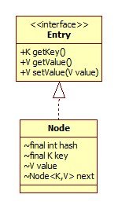

# HashMap 源码分析


类图如下:

<!--more-->


# 构造

我们以无参构造器为例:

```java
public HashMap() {
    this.loadFactor = DEFAULT_LOAD_FACTOR; // all other fields defaulted
}
```

其它的参数均取默认。

# put

```java
public V put(K key, V value) {
    return putVal(hash(key), key, value, false, true);
}
```

putVal源码:

```java
final V putVal(int hash, K key, V value, boolean onlyIfAbsent, boolean evict) {
    Node<K,V>[] tab; Node<K,V> p; int n, i;
    //1.初始化
    if ((tab = table) == null || (n = tab.length) == 0)
        n = (tab = resize()).length;
    //2.bin为null，初始化第一个节点
    if ((p = tab[i = (n - 1) & hash]) == null)
        tab[i] = newNode(hash, key, value, null);
    else {
        Node<K,V> e; K k;
        if (p.hash == hash && ((k = p.key) == key || (key != null && key.equals(k))))
            //指定key的值已存在，那么记录下原先的值
            e = p;
        else if (p instanceof TreeNode)
            //红黑树
            e = ((TreeNode<K,V>)p).putTreeVal(this, tab, hash, key, value);
        else {
            //bin不为空，且与链表头不相同(==或equals)
            //3.
            for (int binCount = 0; ; ++binCount) {
                if ((e = p.next) == null) {
                    p.next = newNode(hash, key, value, null);
                    //达到临界值转为红黑树
                    if (binCount >= TREEIFY_THRESHOLD - 1) // -1 for 1st
                        treeifyBin(tab, hash);
                    break;
                }
                if (e.hash == hash &&
                    ((k = e.key) == key || (key != null && key.equals(k))))
                    break;
                p = e;
            }
        }
        if (e != null) { // existing mapping for key
            V oldValue = e.value;
            if (!onlyIfAbsent || oldValue == null)
                e.value = value;
            //空实现，为LinkedHashMap预留
            afterNodeAccess(e);
            return oldValue;
        }
    }
    ++modCount;
    //4.
    if (++size > threshold)
        resize();
    //空实现，为LinkedHashMap预留
    afterNodeInsertion(evict);
    return null;
}
```

onlyIfAbsent参数如果为true，那么对于已经存在的key，将不替换其值 。table即HashMap进行数据存储的核心变量:

```java
transient Node<K,V>[] table;
```

Node代表了table中的一项，类图:



## 哈希算法

```java
static final int hash(Object key) {
    int h;
    return (key == null) ? 0 : (h = key.hashCode()) ^ (h >>> 16);
}
```

这里在原生hashCode的基础上做了一次与高16位相异或的处理，这样做的目的是将哈希值的高位纳入到取余运算中来，防止由于低位相同造成的频繁冲突的情况。

## 表头还是表尾

当bin中已含有节点链表，且要插入新的元素时从表头还是表尾插入?

从源码(3)中很明显可以看出是从表尾插入，因为HashMap需要判断链表中元素的个数以决定是否将其转为红黑树。

## size

HashMap中维护有一个字段size记录当前元素的个数:

```java
transient int size;
```

从上面putVal方法源码(4)中可以看到其改变方式。

# get

```java
public V get(Object key) {
    Node<K,V> e;
    return (e = getNode(hash(key), key)) == null ? null : e.value;
}
```

剩下的脑补即可。

# resize

```java
final Node<K,V>[] resize() {
    Node<K,V>[] oldTab = table;
    int oldCap = (oldTab == null) ? 0 : oldTab.length;
    int oldThr = threshold;
    int newCap, newThr = 0;
    //原table不为null，
    if (oldCap > 0) {
        //MAXIMUM_CAPACITY取1 << 30，即table数组的大小，如果已到达此值，那么无需扩容
        if (oldCap >= MAXIMUM_CAPACITY) {
            //threshold，CAPACITY乘以负载因子即扩容的临界值
            threshold = Integer.MAX_VALUE;
            return oldTab;
        }
        //没有达到最大值，两倍扩容
        else if ((newCap = oldCap << 1) < MAXIMUM_CAPACITY &&
                 oldCap >= DEFAULT_INITIAL_CAPACITY)
            newThr = oldThr << 1; // double threshold
    }
    else if (oldThr > 0) // initial capacity was placed in threshold
        newCap = oldThr;
    else {
        //初始化，默认大小为16
        newCap = DEFAULT_INITIAL_CAPACITY;
        newThr = (int)(DEFAULT_LOAD_FACTOR * DEFAULT_INITIAL_CAPACITY);
    }
    if (newThr == 0) {
        float ft = (float)newCap * loadFactor;
        newThr = (newCap < MAXIMUM_CAPACITY && ft < (float)MAXIMUM_CAPACITY ?
                  (int)ft : Integer.MAX_VALUE);
    }
    threshold = newThr;
    Node<K,V>[] newTab = (Node<K,V>[])new Node[newCap];
    table = newTab;
    if (oldTab != null) {
        for (int j = 0; j < oldCap; ++j) {
            Node<K,V> e;
            if ((e = oldTab[j]) != null) {
                //数组的此位置含有元素
                oldTab[j] = null;
                if (e.next == null)
                    //如果桶位中只有一个元素=>直接设置
                    newTab[e.hash & (newCap - 1)] = e;
                else if (e instanceof TreeNode)
                    ((TreeNode<K,V>)e).split(this, newTab, j, oldCap);
                else { // preserve order
                    Node<K,V> loHead = null, loTail = null;
                    Node<K,V> hiHead = null, hiTail = null;
                    Node<K,V> next;
                    do {
                        next = e.next;
                        if ((e.hash & oldCap) == 0) {
                            if (loTail == null)
                                loHead = e;
                            else
                                loTail.next = e;
                            loTail = e;
                        }
                        else {
                            if (hiTail == null)
                                hiHead = e;
                            else
                                hiTail.next = e;
                            hiTail = e;
                        }
                    } while ((e = next) != null);
                    if (loTail != null) {
                        loTail.next = null;
                        newTab[j] = loHead;
                    }
                    if (hiTail != null) {
                        hiTail.next = null;
                        newTab[j + oldCap] = hiHead;
                    }
                }
            }
        }
    }
    return newTab;
}
```

## 移动

我们在guava-cache中已经见识过了，假设map的最初容量为8，现要扩容到16，实际上对于每一个桶位(bin)，只有两种情况:

- 无需移动(bin下标不变)，比如hashCode为7的情况。
- 移动到原先下标位置 + 最初容量的位置，比如对于hashCode 12，原本为4，现在要移动至12，移动了8.

那么如何判断是否需要移动呢?

因为我们的容量都是2的整次幂，对8取余我们只要& (8 - 1)即可，所以8和16的mask分别为:

0111

1111

我们只需hashCode & 8即可，这便是源码中preserve order部分所做的。

那么为什么要对一个bin中的每一个元素都要进行判断呢?因为比如对于bin 4，在容量为8的情况下，hashCode为4和12都会进入到这个位置，而扩容后就不一定了。

# 红黑树

其时间复杂度为O(logn)，不再详细探究其细节，可参考:

[教你初步了解红黑树](http://blog.csdn.net/v_july_v/article/details/6105630)

# containsValue

查询是否包含特定的key较为简单，等同于一次get操作，而查询value则不是:

```java
public boolean containsValue(Object value) {
    Node<K,V>[] tab; V v;
    if ((tab = table) != null && size > 0) {
        for (int i = 0; i < tab.length; ++i) {
            for (Node<K,V> e = tab[i]; e != null; e = e.next) {
                if ((v = e.value) == value ||
                    (value != null && value.equals(v)))
                    return true;
            }
        }
    }
    return false;
}
```

这是一个遍历所有bin + 链表/红黑树的过程，所以有过有根据value查找key的需求我们可以使用双向Map，比如Guava的BiMap。


